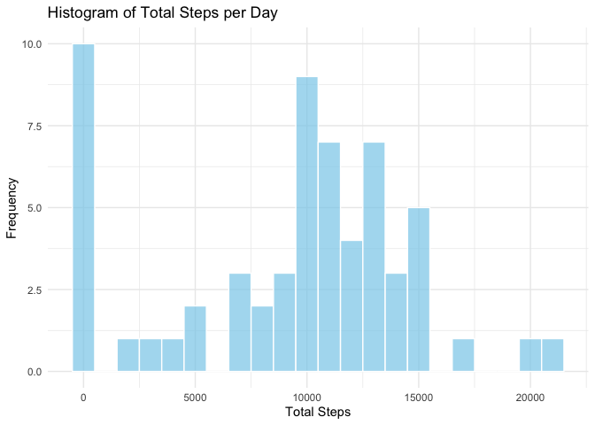
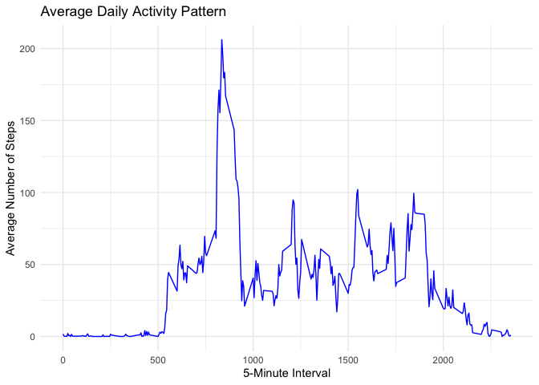
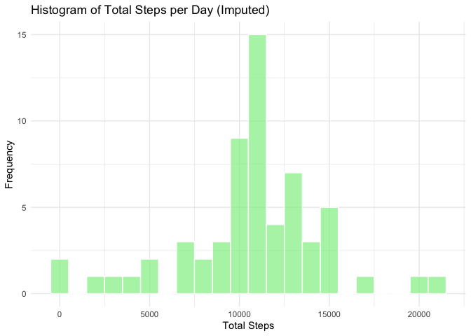
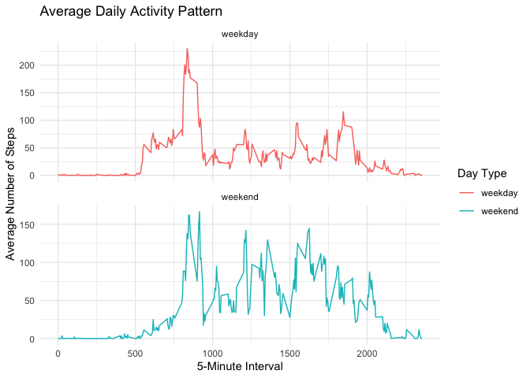

## Loading and preprocessing the data


```r
# Install and load the tidyverse package if not already installed
library(tidyverse)
```

```
## ── Attaching core tidyverse packages ──────────────────────── tidyverse 2.0.0 ──
## ✔ dplyr     1.1.4     ✔ readr     2.1.4
## ✔ forcats   1.0.0     ✔ stringr   1.5.1
## ✔ ggplot2   3.4.4     ✔ tibble    3.2.1
## ✔ lubridate 1.9.3     ✔ tidyr     1.3.0
## ✔ purrr     1.0.2     
## ── Conflicts ────────────────────────────────────────── tidyverse_conflicts() ──
## ✖ dplyr::filter() masks stats::filter()
## ✖ dplyr::lag()    masks stats::lag()
## ℹ Use the conflicted package (<http://conflicted.r-lib.org/>) to force all conflicts to become errors
```

```r
data <- read_csv("activity.csv")
```

```
## Rows: 17568 Columns: 3
## ── Column specification ────────────────────────────────────────────────────────
## Delimiter: ","
## dbl  (2): steps, interval
## date (1): date
## 
## ℹ Use `spec()` to retrieve the full column specification for this data.
## ℹ Specify the column types or set `show_col_types = FALSE` to quiet this message.
```

```r
# Convert the 'date' column to Date type
data <- data %>%
  mutate(date = as.Date(date))
```

## What is mean total number of steps taken per day?

### Make a histogram of the total number of steps taken each day


```r
# Calculate the total number of steps per day
total_steps_per_day <- data %>%
  group_by(date) %>%
  summarize(total_steps = sum(steps, na.rm = TRUE))

# Create a histogram using ggplot2
ggplot(total_steps_per_day, aes(x = total_steps)) +
  geom_histogram(binwidth = 1000, fill = "skyblue", color = "white", alpha = 0.7) +
  labs(title = "Histogram of Total Steps per Day",
       x = "Total Steps",
       y = "Frequency") +
  theme_minimal()
```

<!-- -->

Calculate and report the mean and median total number of steps taken per day

```r
# Calculate and report the mean and median total number of steps taken per day
mean_total_steps <- mean(total_steps_per_day$total_steps)
median_total_steps <- median(total_steps_per_day$total_steps)

# Print the mean and median
cat("Mean total number of steps per day: ", mean_total_steps, "\n")
```

```
## Mean total number of steps per day:  9354.23
```

```r
cat("Median total number of steps per day: ", median_total_steps, "\n")
```

```
## Median total number of steps per day:  10395
```

## What is the average daily activity pattern?

### Make a time series plot (i.e. type = "l") of the 5-minute interval (x-axis) and the average number of steps taken, averaged across all days (y-axis)

```r
# Calculate the average number of steps per 5-minute interval across all days
average_steps_per_interval <- data %>%
  group_by(interval) %>%
  summarize(mean_steps = mean(steps, na.rm = TRUE))

# Make a time series plot
ggplot(average_steps_per_interval, aes(x = interval, y = mean_steps)) +
  geom_line(color = "blue") +
  labs(title = "Average Daily Activity Pattern",
       x = "5-Minute Interval",
       y = "Average Number of Steps") +
  theme_minimal()
```

<!-- -->

### Which 5-minute interval, on average across all the days in the dataset, contains the maximum number of steps?


```r
max_steps_interval <- average_steps_per_interval %>%
  filter(mean_steps == max(mean_steps)) %>%
  select(interval)

# Print the result
cat("5-minute interval with the maximum average number of steps: ", max_steps_interval$interval, "\n")
```

```
## 5-minute interval with the maximum average number of steps:  835
```

## Imputing missing values

### Calculate and report the total number of missing values in the dataset:

```r
# Calculate the total number of missing values in the dataset
total_missing_values <- sum(is.na(data$steps))

# Print the result
cat("Total number of missing values in the dataset: ", total_missing_values, "\n")
```

```
## Total number of missing values in the dataset:  2304
```

### Devise a strategy for filling in all of the missing values in the dataset:

```r
data_imputed <- data %>%
  group_by(interval) %>%
  mutate(steps = ifelse(is.na(steps), mean(steps, na.rm = TRUE), steps))
```

### Create a new dataset that is equal to the original dataset but with the missing data filled in:

### Make a histogram of the total number of steps taken each day and calculate/report the mean and median total number of steps taken per day for the imputed dataset:

```r
# Calculate the total number of steps per day for the imputed dataset
total_steps_per_day_imputed <- data_imputed %>%
  group_by(date) %>%
  summarize(total_steps = sum(steps))

# Create a histogram using ggplot2 for the imputed dataset
ggplot(total_steps_per_day_imputed, aes(x = total_steps)) +
  geom_histogram(binwidth = 1000, fill = "lightgreen", color = "white", alpha = 0.7) +
  labs(title = "Histogram of Total Steps per Day (Imputed)",
       x = "Total Steps",
       y = "Frequency") +
  theme_minimal()
```

<!-- -->

```r
# Calculate and report the mean and median total number of steps taken per day for the imputed dataset
mean_total_steps_imputed <- mean(total_steps_per_day_imputed$total_steps)
median_total_steps_imputed <- median(total_steps_per_day_imputed$total_steps)

# Print the results
cat("Mean total number of steps per day (Imputed): ", mean_total_steps_imputed, "\n")
```

```
## Mean total number of steps per day (Imputed):  10766.19
```

```r
cat("Median total number of steps per day (Imputed): ", median_total_steps_imputed, "\n")
```

```
## Median total number of steps per day (Imputed):  10766.19
```

## Are there differences in activity patterns between weekdays and week-ends?

### Create a new factor variable in the dataset with two levels – “weekday” and “weekend” indicating whether a given date is a weekday or weekend day.


```r
data_imputed <- data_imputed %>%
  mutate(day_type = ifelse(weekdays(date) %in% c("Saturday", "Sunday"), "weekend", "weekday"))
```

### Make a panel plot containing a time series plot (i.e. type = "l") of the 5-minute interval (x-axis) and the average number of steps taken, averaged across all weekday days or weekend days (y-axis). The plot should look something like the following, which was creating using simulated data:


```r
# Calculate the average number of steps per 5-minute interval across weekdays and weekends
average_steps_per_interval_by_day_type <- data_imputed %>%
  group_by(interval, day_type) %>%
  summarize(mean_steps = mean(steps, na.rm = TRUE))
```

```
## `summarise()` has grouped output by 'interval'. You can override using the
## `.groups` argument.
```

```r
# Create a panel plot using ggplot2
ggplot(average_steps_per_interval_by_day_type, aes(x = interval, y = mean_steps, group = day_type, color = day_type)) +
  geom_line() +
  labs(title = "Average Daily Activity Pattern",
       x = "5-Minute Interval",
       y = "Average Number of Steps",
       color = "Day Type") +
  theme_minimal() +
  facet_wrap(~day_type, scales = "free_y", ncol = 1)
```

<!-- -->

